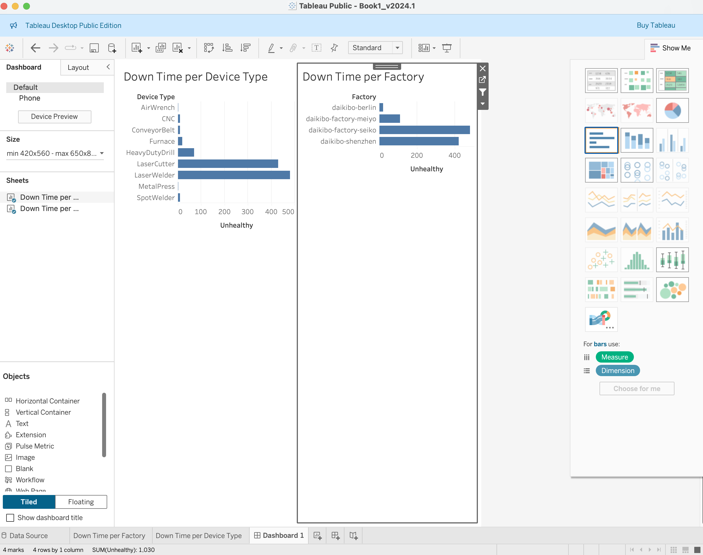

# 📊 Deloitte Data Analytics Simulation – Tableau Dashboard

## Overview
This project was completed as part of the Deloitte Data Analytics Virtual Experience Program (Forage).  
The goal was to analyze operational downtime data and present insights using a Tableau dashboard.

---

## Tools Used
- Tableau
- Excel
- Data Analysis
- Data Visualization

---

## What I Did
- Analyzed operational downtime data across devices and factories  
- Designed and built an interactive Tableau dashboard  
- Applied filters and visualizations to identify trends and patterns  
- Transformed raw data into clear, actionable insights  

---

## Dashboard Preview

---

## Key Insight
The dashboard highlights patterns in operational downtime across different devices and factories, helping identify inefficiencies and areas for improvement.

---

## Certification

Deloitte Data Analytics Virtual Experience Program (Forage)

[View Certificate](deloitte-certificate.pdf)

